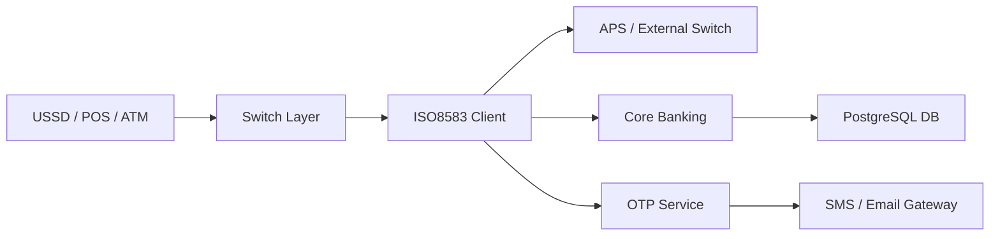

<h1 align="center">Hi 👋, I'm Fazalhaq Fazel</h1>
<h3 align="center">Fintech Backend Engineer | Kotlin | Spring Boot | ISO8583</h3>

---

## 🚀 About Me

- 💳 Building ISO8583 financial messaging systems
- ⚡ Reactive backend engineer (Project Reactor - Mono/Flux)
- 🏦 Working on OTP, USSD, Card & Payment integrations
- 🐳 Dockerized microservices architecture
- 🗄 PostgreSQL & transaction-safe systems
- 🌍 Based in Afghanistan

---

## 🛠 Tech Stack

### Backend

### Database & Infra

---

## 💳 Fintech Focus

- ISO8583 Client & Server implementation
- Custom dialect handling (SVFE_H2H)
- LLVAR / LLLVAR field processing
- ASCII TLV (Field 48)
- Bitmap parsing & financial message validation
- High reliability transaction systems

---

## 📈 GitHub Stats

  

  

---

## 🔄 Contribution Activity

  

---

## 🏦 Banking System Architecture

### Architecture Focus

- 🔁 Async handling with RabbitMQ
- 🧠 Dialect-based ISO8583 parsing
- 🧩 Modular Spring Boot multi-module design
- 🐳 Fully containerized deployment
- 📊 Logging & transaction tracing

---

## 🔐 Secure by Design

Security is not optional in financial systems.

✔️ Input validation at ISO field level  
✔️ Strict LLVAR / LLLVAR length verification  
✔️ Transaction integrity checks  
✔️ Idempotent request handling  
✔️ Sensitive data masking in logs  
✔️ Database transaction management  
✔️ Docker isolation  

---

## 🧪 Testing & Quality Engineering

I design systems that are testable and production-ready.

### Integration Testing
- 🐳 Testcontainers with PostgreSQL
- 🔄 Real database testing (no fake mocks for critical flows)
- 📦 Multi-module integration tests

### Unit Testing
- MockBean isolation
- ISO message validation tests
- STAN uniqueness verification

### Example Stack
- JUnit 5
- SpringBootTest
- Testcontainers
- Kotlin test

---

## 💳 ISO8583 Expertise

- Bitmap parsing & validation
- LLVAR / LLLVAR encoding
- ASCII TLV (Field 48)
- Custom dialect (SVFE_H2H)
- MessageFactory usage
- Financial transaction flow design

---

## 🔥 Current Goals

- Master advanced Spring Boot internals
- Improve ISO8583 performance & resilience
- Contribute to fintech open-source
- Build production-grade financial infrastructure

---

## 📫 Connect With Me

- LinkedIn: (add link)
- Email: (optional)

---

⭐️ Always building secure and scalable financial systems.
